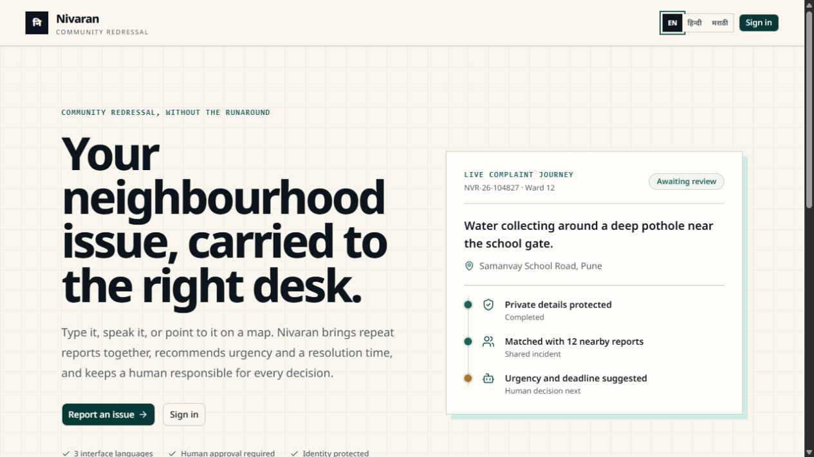
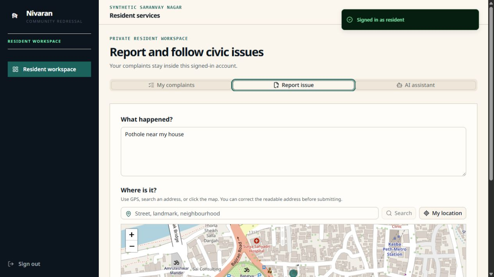
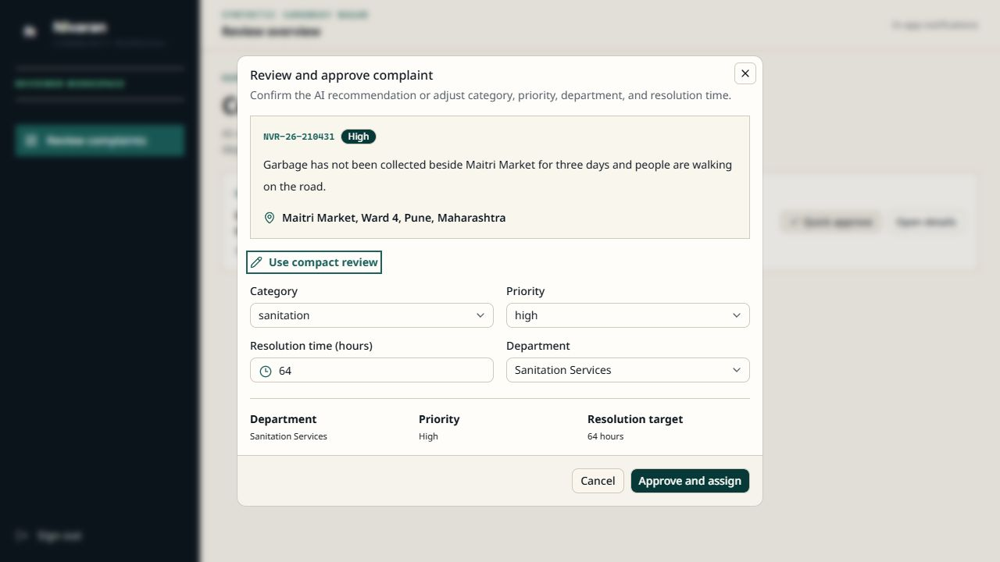
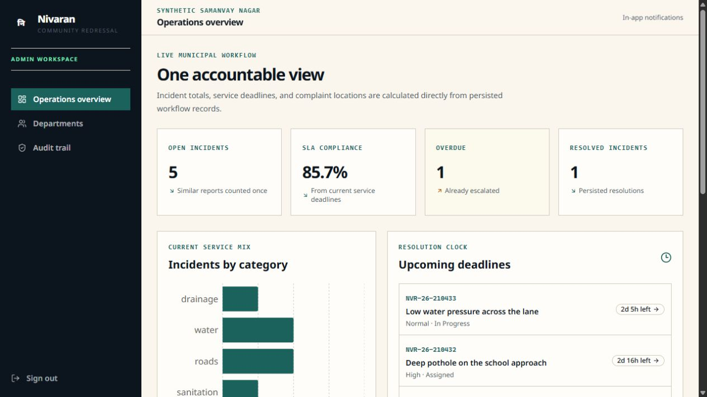

# Nivaran — Community Redressal Planner

Nivaran is a multilingual civic complaint workflow for the synthetic Samanvay Nagar municipality. Residents can type or speak a complaint, attach evidence, verify its location on a map, and follow the resulting service incident. AI recommends category, priority, routing, and a resolution time; a human reviewer must approve or adjust those decisions before any department receives work.

> All municipality, ward, account, complaint, SLA, and department data in this repository is synthetic.



## What the product demonstrates

- English, Hindi, and Marathi resident experiences with translated complaint content.
- Typed intake, a focused complaint-filing assistant, Sarvam-powered Indic voice translation, GPS detection, address search, and map selection.
- Photo and video evidence with authenticated storage access.
- Privacy-first processing that separates reporter identity and redacts common PII before model calls.
- Duplicate prevention that groups similar nearby reports into one incident and displays subsequent reports as `+1`, `+2`, and so on.
- AI-recommended priority and resolution hours with deterministic safety caps and explicit human approval.
- Multiple eligible departments, reviewer routing controls, task dependencies, department acknowledgements, and resolution evidence.
- Persisted SLA deadlines, escalation, notifications, audit events, and an admin map sourced directly from complaint coordinates.
- Honest degraded operation: when AI providers are unavailable, reports are retained, locally checked for duplicates, and sent to manual review.

## Core workflow

```text
Resident report
    ↓
Local privacy redaction
    ↓
AI translation, triage, priority, and deadline recommendation
    ↓
Nearby duplicate match → existing incident +1
    ↓
Human approval or adjustment
    ↓
Department assignment and SLA clock
    ↓
Resolution, resident update, and audit trail
```

## Product views

### Resident intake and map verification

The map is available immediately. GPS, address search, and direct map selection all store readable addresses together with complaint coordinates.



### Human approval

Reviewers can adjust category, priority, department, and resolution hours. Complaint location remains read-only, and there is no unnecessary free-text override form.



### Synchronized operations overview

Admin totals count shared incidents rather than duplicate submissions. Category totals, deadlines, and map markers are generated from persisted workflow records.



## Stack

| Layer | Technology |
| --- | --- |
| Web | Next.js App Router, TypeScript, Tailwind CSS, shadcn/ui, Recharts, Leaflet |
| API | FastAPI, Pydantic, SQLAlchemy, Alembic |
| Data | PostgreSQL + pgvector in Docker; SQLite for lightweight local development |
| AI | OpenAI Responses API and embeddings; Sarvam speech translation |
| Runtime | Docker Compose services for web, API, worker/SLA scheduler, and database |

## Run with Docker

1. Copy `.env.example` to `.env`.
2. Set a strong `JWT_SECRET`.
3. Optionally add `OPENAI_API_KEY` and `SARVAM_API_KEY` for live AI and voice capabilities.
4. Start the complete stack:

```powershell
docker compose up --build
```

Open [http://localhost:3000](http://localhost:3000). API documentation is available at [http://localhost:8000/docs](http://localhost:8000/docs), and readiness is exposed at `/ready`.

## Run without Docker

Start the API:

```powershell
cd apps/api
python -m uvicorn app.main:app --reload --port 8000
```

Start the persistent worker in a second terminal:

```powershell
cd apps/api
python -m app.worker
```

Start the web application:

```powershell
cd apps/web
npm install
npm run dev
```

Without provider credentials, typed intake remains available and complaints enter the manual-review path without fabricated model results.

## Demo access

The login screen includes seeded Resident, Reviewer, Department, and Admin accounts. Credentials for every individual department are documented in [DEMO_ACCOUNTS.md](DEMO_ACCOUNTS.md).

The main multilingual demonstration complaint is `NVR-26-104827` with tracking PIN `4827`. Additional coherent demo incidents cover sanitation review, assigned road work, water work in progress, and resolved drainage work.

## Validation

Backend:

```powershell
cd apps/api
python -m pytest -q
```

Frontend:

```powershell
cd apps/web
npm run lint
npm test -- --run
npm run build
```

After changing FastAPI schemas, regenerate the TypeScript contract from `apps/web` with `npm run types:api` while the API is running.

## Repository notes

- `/lite` is text-first and excludes map and analytics bundles.
- Telecom SMS delivery is intentionally not simulated; a real adapter can be added later.
- Reporter identity is never included in department task payloads or public map data.
- Evidence images are not sent to AI models in the MVP.
